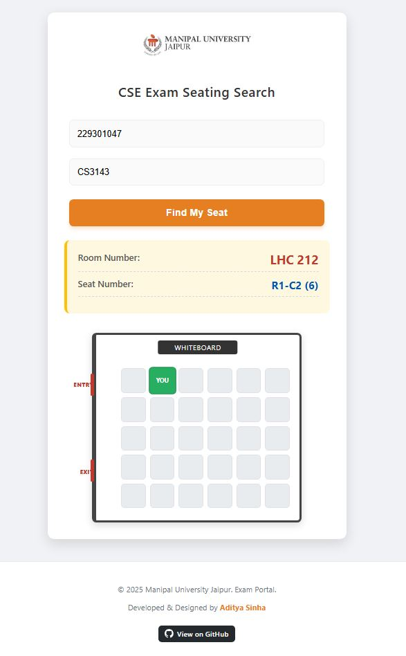

# 🎓 CSE Exam Seating Finder - MUJ

### 🔗 [Click Here to View Live Website](https://adityasinha-1988.github.io/CSE-Exam-sitting-finder/)

---

## 📖 Overview
**CSE Exam Seating Finder** is a web-based portal developed exclusively for the **Department of Computer Science & Engineering (CSE)** at **Manipal University Jaipur**.

This tool solves the chaos of finding exam seats on notice boards. Students can simply enter their **Registration Number** and **Course Code** to instantly get their **Room Number** and **Seat Number**.

The highlight of this project is the **Interactive Visual Map**, which shows the student exactly where to sit inside the classroom relative to the entry/exit doors.

---

## 📸 Screenshots
### 🖥️ Desktop View

---

## ✨ Key Features
* 🔍 **Instant Search:** Get results in milliseconds by entering Registration No. & Course Code.
* 🗺️ **Visual Classroom Map:** A dynamic 5x6 seating grid that visualizes the room layout.
* 📍 **Smart Highlighting:** The allocated seat pulses in **Green** with a "YOU" marker for easy identification.
* 🚪 **Accurate Orientation:** Displays **Entry** and **Exit** doors on the left wall to help students orient themselves.
* 📱 **Mobile Responsive:** Fully optimized for smartphones, tablets, and desktops.
* 🧩 **Column-Wise Logic:** Reflects the actual exam seating pattern (filling front-to-back, column by column).

---

## 🚀 How It Works
1.  **Data Processing:** Exam data is processed from Excel sheets using a custom **VBA Script** to generate a lightweight JSON dataset (`student_data.js`).
2.  **Input:** The student enters their details on the website.
3.  **Logic:** The JavaScript engine searches the dataset and retrieves the allocated Room and Seat.
4.  **Visualization:** The code generates a visual grid of the classroom and highlights the specific seat coordinates (e.g., `R2-C3`).

---

## 🛠️ Tech Stack
* **Frontend:** HTML5, CSS3 (Animations & Grid Layout), JavaScript (ES6).
* **Data Handling:** Excel VBA (for JSON generation) & JSON.
* **Hosting:** GitHub Pages.

---

## 👨‍💻 Developed By
**Aditya Sinha**
* Department of Computer Science & Engineering
* Manipal University Jaipur

---

  Made with ❤️ for MUJ Students

